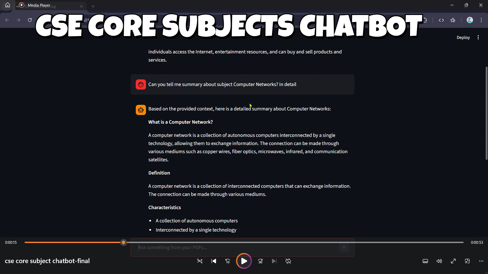

# 🚀 GenAI-Powered CSE Core Subjects Chatbot : 

A Generative AI-based chatbot designed specifically for **Computer
Science Engineering (CSE) core subjects**..

This project leverages Retrieval-Augmented Generation (RAG) to provide
accurate, context-aware answers directly from CSE subject PDFs such as:

-   Data Structures
-   Operating Systems
-   DBMS
-   Computer Networks
-   Compiler Design
-----------------------------------------------------------------------

------------------------------------------------------------------------

## 🔍 Features

-   ✅ Retrieval-Augmented Generation (RAG) Architecture\
-   ✅ Built with LangChain\
-   ✅ Tracing & Observability using LangSmith\
-   ✅ PDF Chunking & Embedding\
-   ✅ FAISS Vector Database Integration\
-   ✅ Context-grounded LLM Responses\
-   ✅ Streamlit-based Interactive UI\
-   ✅ Demo Video Included\
-   ✅ Open Source
  
------------------------------------------------------------------------

## 🧠 How It Works

1.  Extracts and chunks CSE subject PDFs\
2.  Converts text chunks into embeddings\
3.  Stores embeddings in a FAISS vector database\
4.  Retrieves the most relevant context for user queries\
5.  Generates precise responses using an LLM

This RAG-based approach ensures responses are grounded in actual
academic content, significantly reducing hallucinations.

------------------------------------------------------------------------

## 🛠️ Tech Stack

-   Python\
-   LangChain\
-   LangSmith\
-   FAISS\
-   Streamlit\
-   HuggingFace Embeddings\
-   LLM Integration

------------------------------------------------------------------------

## 📂 Project Structure

    ├── app.py
    ├── requirements.txt
    ├── data/
    ├── vectorstore/
    └── README.md

------------------------------------------------------------------------

## 💡 Motivation

As an engineering student, revising core subjects often requires
navigating through lengthy PDFs.\
This project aims to provide a smarter AI-powered academic assistant
that simplifies revision and enhances learning efficiency.

------------------------------------------------------------------------

## 🎯 Key Learnings

-   Practical implementation of Generative AI\
-   Building end-to-end RAG pipelines\
-   Vector database integration\
-   LLM orchestration\
-   Observability and tracing in AI applications

------------------------------------------------------------------------
## 🤝 Contributing

Contributions, suggestions, and feedback are welcome!\
Feel free to fork the repository and submit a pull request.

------------------------------------------------------------------------

## 📬 Connect

If you're interested in AI/ML, RAG systems, or EdTech innovation ---
let's connect!

------------------------------------------------------------------------

⭐ If you find this project useful, consider giving it a star!

## 👨‍💻 Contributors
- [@ash-iiiiish](https://github.com/ash-iiiiish)

## 🤝 Contributing
Contributions are welcome! Fork this repository and submit a pull request.
